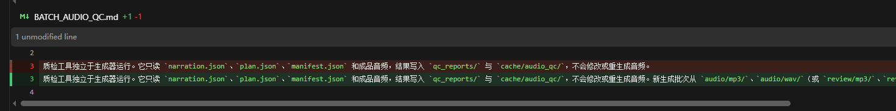
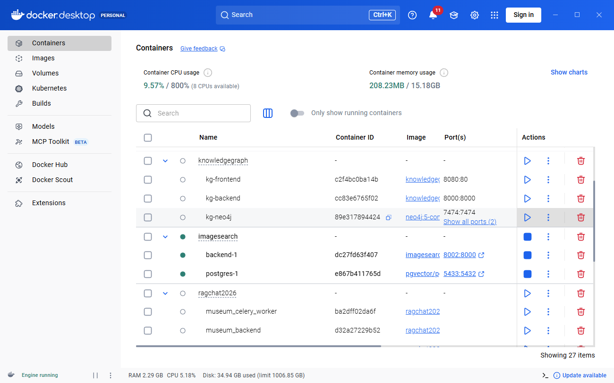
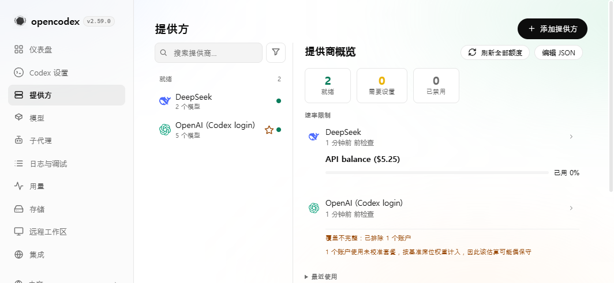
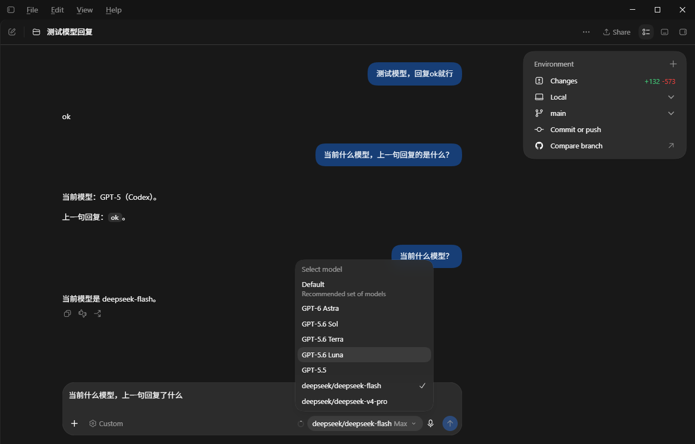
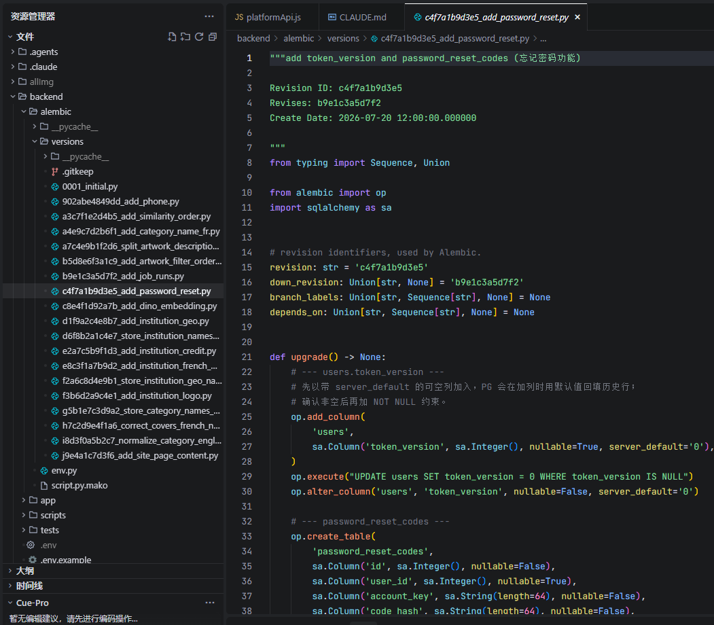
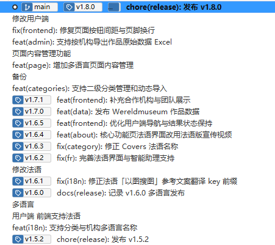
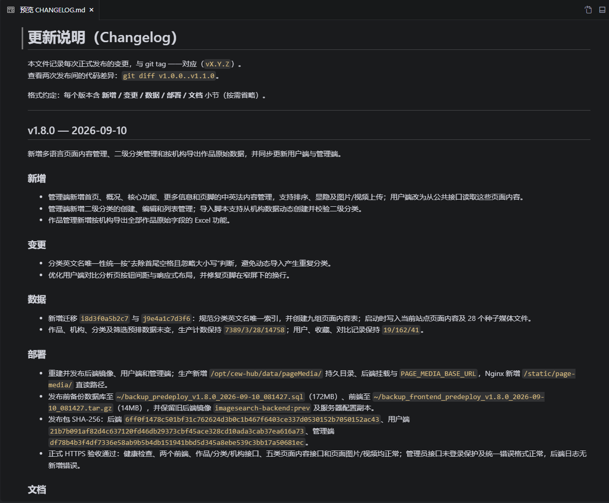
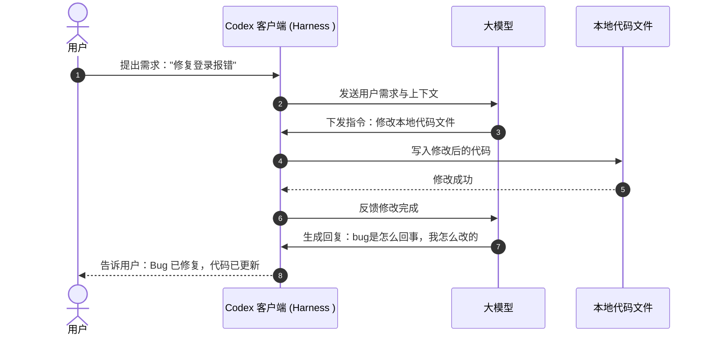
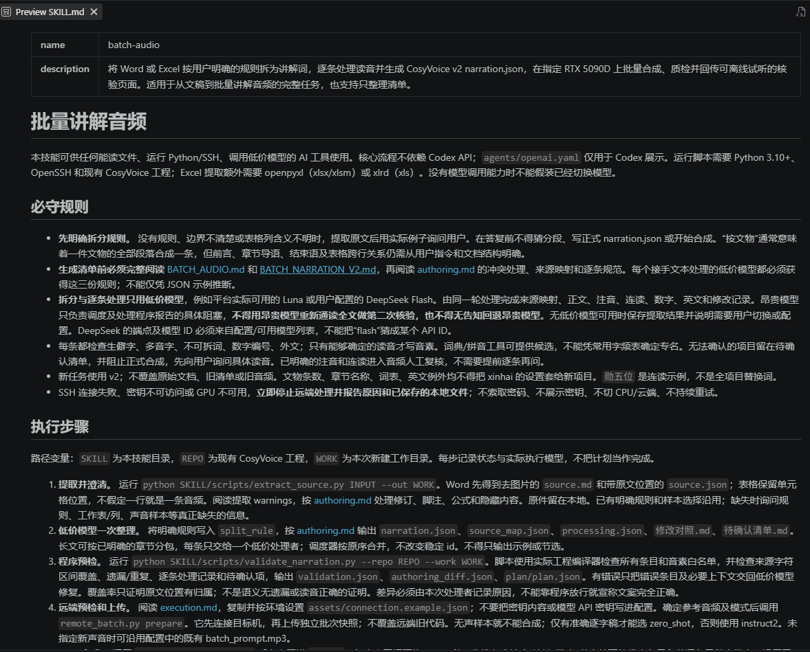

# AI 辅助全栈开发培训

## 第一部分：AI 编程工具与工程技巧

### 1.1 基础环境

**要使用对AI友好的工具**。
文档使用markdown，表格使用csv，尽量不使用word、Excel、pdf，这些类似于二进文件，AI操作起来要借助工具，比较费token。markdown、csv是文本文件，类似于txt，AI可以直接读取，并且可以方便的进行对比，明确修改了那一行。



不得不使用word文档时，建议先让AI将word转为markdown，对markdown进行后续的编辑，最终确定之后，再转为word发出去。

代码管理使用git，而不要使用svn。

Git 支持本地提交和轻量分支，方便在 AI 修改代码前保存版本，修改后检查差异、按需回退。使用 worktree 还能让多个任务在独立目录中进行，减少相互干扰。这些能力适合 AI 辅助开发中频繁试验、小步验证的工作方式。
还可以与GitHub CLI搭配使用，安装GitHub CLI之后，可以让AI直接操作GitHub，例如跟AI说：`创建GitHub私有仓库，并上传代码`。就可以直接换台电脑继续干活，减少手动创建仓库上传代码这些繁琐操作。

尽量使用Docker，避免环境差异带来的问题，方便迁移，方便AI自动化执行。



### 1.2 思想转变

使用 AI 后，我们要重点关注这3个问题：
- **要做什么？** 需求、业务规则和范围是否明确。比如：需不需要维护数据
- **为什么这样做？** 技术方案是否适合现有项目。比如：客户要自己部署，如果加后端部署就太麻烦，所以搞一个json文件存储数据
- **怎么证明做对了？** 是否有可执行的验收步骤和实际结果，方便AI自测。比如：文件夹、json、前端看到的数据完全一致。

至于如何做，可以由AI主导，程序员关注整体，不必太关注实现细节。

### 1.3 开发流程
尤其是复杂需求与大功能，如果只写一段提示词就直接让 AI 开始写代码，输出的结果很多时候都不是想要的，还要浪费token去改。并且如果时间跨度比较长，自己会忘，AI也没有足够的上下文去记忆。所以一定要先形成文档。所以按照以下步骤推进：

> **讨论需求 → 确认方案 → 写入 Markdown → 分阶段实现 → 验证**

最终让 AI 输出一个结构清晰的 Markdown 文档（如 `docs/plan.md`）。这份文档是后续指导 AI 逐步编码的核心依据，应重点包含以下三部分：

1. **确认的需求**
   - **业务范围**：明确“本次要做什么”以及明确“**本次不做什么**”（防止AI加戏）。
   - **核心规则**：字段限制、权限边界、异常情况处理（未登录、非法入参、数据不存在等）。
2. **每个功能的详细设计**
   - **界面设计**：页面布局、关键表单与数据展示、交互反馈。
   - **技术设计**：技术选型、接口约定（URL、请求/响应结构、状态码）、数据表或存储结构。
   - **实现思路**：数据流转逻辑、前后端分工、核心业务处理流程。
   - **验收标准**：明确“怎样证明做对了”，给出可执行的验证步骤与期望结果，便于 AI 自测和人工验收。
3. **拆分好的实现阶段**
   - **分步骤实现**：将大任务拆分为若干个可独立运行、前后端打通的子阶段，避免一次写太多，失控。
   - **注明实现难度**：为每个阶段标注难度（如：**简单 / 中等 / 复杂**），方便后续针对不同阶段灵活选择合适的 AI 模型。

需求部分以人为主导，ai作为辅助。详细设计ai为主导，但是人一定要仔细审。

需求讨论阶参考提示词
```text
我要开发xxx功能，这个功能要求是xxxx（具体的需求）。先不写代码，先跟我讨论，将我的需求细化完善，任何你认为不明确、不完善、不合理的地方，都要跟我沟通，直到明确需求，达成共识。
```

生成文档参考提示词
```text
需求已经讨论清楚，先不要写业务代码。
请把刚才确认的内容整理成技术方案文档，保存到 docs/plan.md 中，这个文档要作为后续编码的唯一依据，所以务必准确、完整。
文档必须包含以下三部分：
1. 确认的需求（明确要做和不做的范围、业务规则与异常处理）
2. 每个功能的详细设计（界面布局与交互、技术选型与接口约定、实现思路、具体的验收标准）
3. 拆分好的实现阶段（按可独立验证的小闭环拆分，并标注每个阶段的实现难度：简单 / 中等 / 复杂，以及建议使用的模型）
```

开发阶段参考提示词
```text
按照 docs/plan.md。开始开发【阶段一：xxx】，完成之后提交代码（一定要提交代码，万一有问题还能回退）
```

这个阶段一定要有耐心，多花时间看AI生的文档，要不然一开始就跑偏，后续就麻烦了。

对于大型项目，建议采用逐步分解的方式。

### 1.4 模型编程能力对比

| 常见编程指标 | GPT-6 Astra | GPT-5.6 Sol | GPT-5.6 Terra | GPT-5.6 Luna | DeepSeek V4.1 Flash | Kimi K3 | GLM-5.3 |
| --- | ---: | ---: | ---: | ---: | ---: | ---: | ---: |
| DeepSWE v1.1（真实代码库中的长期修复） | 74.1 | 72.7 | 69.6 | 67.2 | 74.2 | 67.5 | 66.9 |
| Terminal-Bench 2.1（终端操作、规划与工具协作） | — | 88.8 | 87.4 | 84.7 | 90.6 | 88.3 | 88.2 |
| Terminal-Bench 4.0（更新、更难的终端 Agent 任务） | 57.9 | 37.3 | — | — | 31.2 | 12.6 | 37.9 |
| SWE-Bench Pro（专业软件工程问题修复） | — | 64.6 | 63.4 | 62.7 | — | — | — |
| FrontierCode 1.1 Extended（高难度新颖编程任务） | 64.5 | 60.6 | — | — | — | — | — |
| NL2Repo-Bench（自然语言需求到仓库级实现） | — | 56.8 | — | — | 64.0 | 58.0 | 58.0 |
| ProgramBench Almost@1（复杂程序开发） | — | 23.0 | — | — | 20.3 | 17.5 | 19.0 |
| SWE-Marathon v1.1（长时间工程任务） | — | 42.5 | — | — | — | 48.1 | 42.5 |

#### 编程能力的大致排序

**Claude Fable 5.1 > GPT-6 Astra > DeepSeek V4.1 Flash ≈ GPT-5.6 Sol > GPT-5.6 Terra ≈ GLM-5.3 ≈ Kimi K3 > GPT-5.6 Luna**

除了第前两名和最后一名，其他模型能力非常接近。如果使用codex客户端，优先考虑GPT系列模型。日常建议使用GPT-5.6 Sol或者GPT-5.6 Terra，复杂需求或者做规划时使用GPT-6 Astra。

> 数据来源：[OpenAI API 模型页](https://developers.openai.com/api/docs/models)、[OpenAI GPT-6 Astra](https://openai.com/index/gpt-6-astra/)、[OpenAI GPT-5.6](https://openai.com/index/gpt-5-6/)、[DeepSeek V4.1 Flash 官方模型卡](https://huggingface.co/deepseek-ai/DeepSeek-V4.1-Flash)、[Kimi K3 官方介绍](https://www.kimi.com/en/blog/kimi-k3)、[GLM-5.3 官方模型卡](https://huggingface.co/zai-org/GLM-5.3)。

### 1.5 其他技巧

#### 1.5.1 如何节省额度
**`控制输入输出`**

总用量=输入+输出+推理。

输入中的上下文会占用大量额度，尽量只输入必要信息。也不要少输入，比如：你明明知道是哪个界面的报错，却不告诉具体的路由地址或者接口地址，只是笼统的说，界面弹出了什么错误，它只能不断的调用工具去搜索，去分析，反而会占用更多额度。

**`合理利用缓存`**

缓存失效时间是30分钟，如果一个长对话，停止对话超过30分钟之后还要继续，建议先压缩。

缓存不会在不同模型之间共享，所以尽量不要中途切模型，如果必须切换，建议先压缩再切，或者先总结，再新开一个对话。

切换思考等级，缓存不会丢。额度不多时，可以用低思考等级，遇到难题再提高。

**`高低搭配`**

讨论需求和做详细设计时使用高级模型，高级模型把具体怎么做都想好了，实际开发可以交给低等级模型（gpt 5.6 terra）去执行。

**`利用聊天模式`**

codex和工作模式共用5小时和周额度限制，聊天模式没有对话限制。讨论需求或者项目无关的技术问题，可以在聊天模式里，这样不占用额度。缺点：聊天模式无法读取和写入本地文件。

**`关注重置消息`**

可以在X上关注Tibo，https://x.com/thsottiaux，这个人是codex的产品负责人，每次重置之前都会在X上发布预告，可以在看到预告消息之后赶紧用额度。

#### 1.5.2 如何解决5小时限制

5小时限制并不是固定时间段，是从发第一条消息开始算，如果9点开始用，那就是9-14点、14点-19点，上班时间只能用两个5小时额度，要多干活就要加班。可以利用定时任务去解决这个问题。
给gpt发如下提示词：

``` text
东京时间，每天早上7点，使用 Luna 模型，低思考等级,给我发一条消息，告诉我昨天晚上美股的行情，只需要告诉我纳斯达克指数和标普指数的涨跌百分比，最简单的方式告诉我，不要浪费token
```
这样额度就变成了6-11点、11-16点、16-21点，上班时间能用满3个5小时额度（周额度的48%）。

> 重点：一定要用 Luna 模型，低思考等级，并且是个简单任务。

#### 1.5.3 如何防止封号、降智
虽然现在gpt几乎不封号，为了防止将来政策收紧，并且为了防止降智，最好确保`支付地区、IP地区、电脑时区`都一致。之前网上很多人反应，中文区被路由到低等级模型，你以为你在用GPT 6，其实是GPT 5.6，就是因为被检测出来了，算力不够的时候，就先降中国用户。

尽量上午用，与国外用户错峰使用，避免算力不够被降智。

#### 1.5.4 如何接入其他模型

可以使用opencodex、codex-switch、CC Switch等





截图中使用的是 https://github.com/lidge-jun/opencodex

#### 1.5.5 其他客户端

编码能力 = 模型能力 + 客户端能力，客户端（Harness）与模型同样重要。

pi https://pi.dev/

OpenCode https://opencode.ai/zh

claude code https://github.com/anthropics/claude-code

上述客户端都很不错，可以尝试。尤其是claude code +  claude官方模型，能力很强，可以想办法试试。

Antigravity https://antigravity.google/product/antigravity-ide 

代码能力一般，但是写文档能力不错，可以在咸鱼花十几块代充google gemini 1年会员，非正规途径，最好用小号，可能会被封号。

deepseek harness https://www.deepseek.com/harness/ 

deepseek官方工具，与deepseek适配比较好，不太成熟，可以关注后续发展。

## 第二部分：常用后端技术栈与项目组织
### 2.1 先理解一次请求如何流转

```text
用户填写页面
    ↓
frontend：处理交互，发送 HTTP 请求
    ↓
backend：识别身份、校验输入、执行权限和业务规则
    ↓
数据访问：读取或写入 PostgreSQL
    ↓
backend：整理公开响应，记录必要日志
    ↓
frontend：显示成功、失败、加载中或空状态
```
### 2.2 Python 技术栈

这是一个常见的后端技术栈，AI也很熟悉，写出来的代码质量也高，推荐使用。

#### 2.2.1 技术栈

| 层次 | 推荐技术 | 负责什么 |
| --- | --- | --- |
| 语言 | Python 3.12 / 3.13 | 后端业务逻辑 |
| Web 框架 | FastAPI | 路由、依赖处理、HTTP 接口 |
| API Schema | Pydantic | 定义和校验请求、响应的数据结构 |
| ORM | SQLAlchemy 2.x | 数据模型、查询和数据库会话 |
| 数据库迁移 | Alembic | 管理数据库结构的版本变化 |
| 数据库 | PostgreSQL | 持久化业务数据 |
| 缓存 | Redis | 按需缓存和其他临时数据；没有需求先不装 |
| 后台任务 | Celery | 按需异步任务、重试与独立 worker；没有需求先不装 |
| 测试 | pytest | 单元测试和接口测试组织 |
| Lint / Format | Ruff | 代码检查和格式化 |
| 依赖管理 | uv | 项目环境、依赖与锁文件 |
| 配置 | pydantic-settings | 从环境等来源加载应用配置 |
| 部署 | Docker + Docker Compose | 打包应用和组织服务 |
| Web Server | Uvicorn | 作为 ASGI 服务器运行 FastAPI 应用 |


#### 2.2.2 目录示例

下面展示前后端同仓库下的整体项目结构，将 `frontend/` 和 `backend/` 放在同一个父级项目文件夹中统一管理：

```text
project/
├─ frontend/
│  ├─ src/
│  │  ├─ api/                    # 请求封装与生成客户端入口
│  │  ├─ components/             # 通用界面组件
│  │  ├─ features/
│  │  │  └─ tickets/             # 业务特性模块（工单列表、详情、表单等）
│  │  ├─ router/                 # 前端路由配置
│  │  ├─ stores/                 # 全局状态管理（按需）
│  │  ├─ App.tsx                 # 根组件
│  │  └─ main.tsx                # 入口渲染文件
│  ├─ public/                    # 静态资源
│  ├─ index.html
│  ├─ package.json
│  ├─ tsconfig.json
│  ├─ vite.config.ts
│  ├─ .env.example
│  └─ README.md
├─ backend/
│  ├─ app/
│  │  ├─ __init__.py
│  │  ├─ main.py                 # 创建应用、注册路由
│  │  ├─ core/
│  │  │  ├─ config.py            # pydantic-settings 配置
│  │  │  ├─ security.py          # 身份与权限相关基础逻辑
│  │  │  └─ logging.py           # 日志配置
│  │  ├─ db/
│  │  │  ├─ base.py              # ORM 模型基类
│  │  │  └─ session.py           # 数据库连接与会话
│  │  └─ modules/
│  │     ├─ users/
│  │     │  ├─ router.py
│  │     │  ├─ schemas.py
│  │     │  ├─ models.py
│  │     │  └─ service.py
│  │     └─ tickets/
│  │        ├─ router.py         # HTTP 路由
│  │        ├─ schemas.py        # 请求与响应模型
│  │        ├─ models.py         # 数据库模型
│  │        └─ service.py        # 业务规则与用例
│  ├─ migrations/
│  │  ├─ env.py                  # Alembic 环境及模型元数据
│  │  └─ versions/               # 数据库迁移文件
│  ├─ tests/
│  │  ├─ conftest.py             # 测试环境与公共 fixture
│  │  ├─ unit/
│  │  └─ integration/
│  ├─ alembic.ini
│  ├─ pyproject.toml
│  ├─ uv.lock
│  ├─ .python-version
│  ├─ .env.example
│  ├─ Dockerfile
│  └─ README.md
├─ compose.yaml                  # 本地编排前后端与数据库
├─ .gitignore
└─ README.md
```

> 一定要将前后端放在一个git仓库中，这样方便codex同时读取前后端代码，方便版本控制、上线部署等一系列操作。

### 2.3 TypeScript + NestJS 技术栈


熟悉 TypeScript、Node.js的可以继续使用这些进行后端开发。这是AI推荐的，AI比较熟悉的一个技术栈。

| 层次 | 推荐技术 | 负责什么 |
| --- | --- | --- |
| 运行时 | 与依赖兼容的 Node.js LTS | 执行后端应用；项目固定具体版本 |
| 语言 | TypeScript | 类型声明与业务实现 |
| Web 框架 | NestJS | 模块、路由、依赖注入与应用组织 |
| 参数校验 | DTO + class-validator + class-transformer | 配合 ValidationPipe 校验实际请求 |
| 接口文档 | `@nestjs/swagger` / OpenAPI | 描述接口并用于生成客户端 |
| ORM | Prisma | 数据模型、数据库客户端和查询 |
| 数据库迁移 | Prisma Migrate | 管理数据库结构变化 |
| 数据库 | PostgreSQL | 持久化业务数据 |
| 缓存 | Redis | 有明确需求再引入 |
| 后台任务 | BullMQ + Redis | 有队列、重试、独立 worker 需求再引入 |
| 测试 | Jest 或 Vitest，配合 Supertest | 单元与 HTTP 集成测试，沿用所选模板 |
| Lint / Format | 项目已有 Linter + Prettier | 可采用 ESLint；模板已有 oxlint 时先沿用 |
| 依赖管理 | npm 或 pnpm | 团队统一选择一个，并提交对应锁文件 |
| 配置 | `@nestjs/config` + 启动时校验 | 读取并验证配置 |
| 部署 | Docker + Docker Compose | 打包并运行服务 |

### 2.4 部署和更新
优先使用linux服务器，并配置好SSH远程连接，Windows也可以安装OpenSSH，这样就可以让AI直接操作服务器，进行部署和更新。

可以使用如下提示词，让AI创建一个部署更新Skill，后续直接对AI说【部署到正式服务器】就行。
```text
创建一个部署和更新的Skill，方便我后续将代码更新到服务器。要求如下：
服务器远程方式是xxx，按照以下顺序执行：
1. 定范围 —— 看 git 和 更新说明文档，搞清"上次 tag → 现在"改了什么，推断要更新哪几块。
2. 备份 —— 只要这次涉及数据库（迁移或数据变化），动手前先在服务器全量备份。
3. 执行 —— 按范围构建发布包、上传、在服务器更新。
4. 验证 —— 经公网 IP 实测健康检查、接口、前端、本次新功能。验证不通过，立即回滚，并记录回滚日志。
5. 收尾 —— 验证通过才改 `更新说明.md`、提交代码、打 `vX.Y.Z` tag。
```

### 2.5 个人经验
要提前定好接口的基础规范，例如:
```
{
  code:0,
  message:"成功",
  data:{

  }
}
```
根据项目实际情况考虑接口的安全性，是否需要 token 鉴权、防止恶意请求等。
重点逻辑要形成文档，防止遗忘，也可以方便AI理解业务逻辑。但是文档要及时更新，不然会误导AI。
要使用数据库迁移框架，自动生成和更新数据库表结构。



更新之后要在git中打上tag，并与更新日志一一对应。





## 第三部分：其他AI知识

### 2.1 Agent（智能体）

给它一个目标（例如“修复登录 bug 并跑通测试”），它能自主**拆解步骤、调用工具（读写代码、运行终端命令）、检查报错自我修正**，直到任务达成。

Agent = LLM（大模型） + Harness 

Harness 翻译过来是马具，所以可以通俗理解，Agent就是一匹带有马具（马鞍、马镫）的马。大模型就是马，能力很强，不好驾驭，需要马鞍、马镫这些，组合在一起才能发挥出最大的能力。

拿codex举例，codex就是一个Agent，实际上由gpt模型和codex客户端组成，客户端提供基本的文件读写、检索、运行终端等能力，大模型提供思维能力。

#### codex修复 Bug 时的协作过程（简化版）



**简单总结 Agent 的执行过程：**

1. **大模型负责出主意（大脑）**：大模型不直接碰电脑，只负责理解需求、分析逻辑，向客户端下发修改代码的指令。
2. **Harness负责动手干活（手脚）**：Codex 客户端在本地电脑执行指令，真正完成代码文件的写入修改。
3. **循环**：将一个大任务通过拆解，不断循环，最终实现目标。例如：修改bug要经过，读取文件->分析->修改文件->自测->继续读取->修改...直至成功

### 2.2 Skill（技能）
一段封装好的提示词，类似于代码中的封装的方法或者库。任何有规律的过程都可以写成skill，方便后续重复使用。本质就是一个写着提示词的markdown文件。例如，这是一个批量生成音频的技能，过程很长，每次都写一遍，太费劲，就写成技能文件。



技能与普通markdown的区别就是技能会自动触发，每次对话时，都会将所有技能的描述带过去，大模型会自动判断是否需要调用某个技能。

### 2.3 MCP（Model Context Protocol，模型上下文协议）

大模型和外部工具通用的标准化连接协议。其实就是规定了格式的http请求，方便大模型与外部系统对接，例如：可以通过MCP去读取Figma的设计稿，通过MCP去读取禅道的bug，修复之后自动更新bug状态 等等。如果你有比较常用的工具想接入AI，可以去官方找找有没有MCP。

### 2.4 CLI（命令行工具）

功能上来讲与MCP类似，都是为了与外部对接，但是CLI是通过命令行实现的，命令可以自由组合，更加灵活。例如：
Unity CLI：让AI通过命令行管理和操作 Unity 引擎及其编辑器的官方工具

YoudaoNote CLI：让AI通过命令行读取或操作有道云笔记

